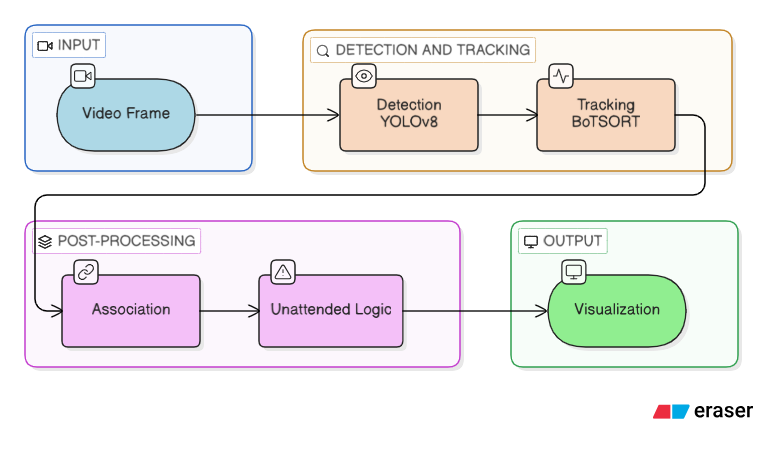

# Unattended Bag Detection System

Real-time security system that detects bags in video, associates them with nearby people, and alerts when a bag is left unattended.

## Architecture



The system uses YOLOv8 pretrained on COCO to detect persons and bags (backpacks, handbags, suitcases) in each frame. BoTSORT assigns persistent track IDs across frames so objects can be followed over time. A Hungarian algorithm with IoU and proximity scoring links each bag to its nearest owner, with hysteresis to prevent flickering between people. A state machine tracks each bag through UNKNOWN → OWNED → SEPARATED → UNATTENDED states, triggering an alert after a configurable timeout. The output is visualized with color-coded bounding boxes, association lines, countdown timers, and alert banners.

## Setup

```bash
pip install -r requirements.txt
```

The YOLOv8 model weights download automatically on first run.

## Quick Start

This shows a person placing a bag and walking away. The bag turns yellow (separated), then red (unattended) after 3 seconds.

```bash
python main.py --source videos/test_video.avi --output result.mp4 --no-display
```

## Usage

```bash
# Webcam
python main.py --source 0

# Video file
python main.py --source path/to/video.mp4

# Save output video (headless)
python main.py --source video.mp4 --output result.mp4 --no-display
```

### CLI Options

| Flag | Default | Description |
|------|---------|-------------|
| `--source` | `0` (webcam) | Video file path or camera index |
| `--no-display` | off | Run without GUI window |
| `--output` | none | Save annotated video to file |

Press **q** to quit.

## Visual Color Coding

| Color | Meaning |
|-------|---------|
| Green | Person |
| Blue | Owned bag (near its owner) |
| Yellow | Separated bag (owner walked away, timer counting) |
| Red | Unattended bag (timeout exceeded) |

## Configuration

All tuneable parameters are in `config.py`: model settings, class IDs, tracking history length, association thresholds, separation distance, timeout duration, and colors.

## Demo Videos

### Demo Video 1


### Demo Video 2


